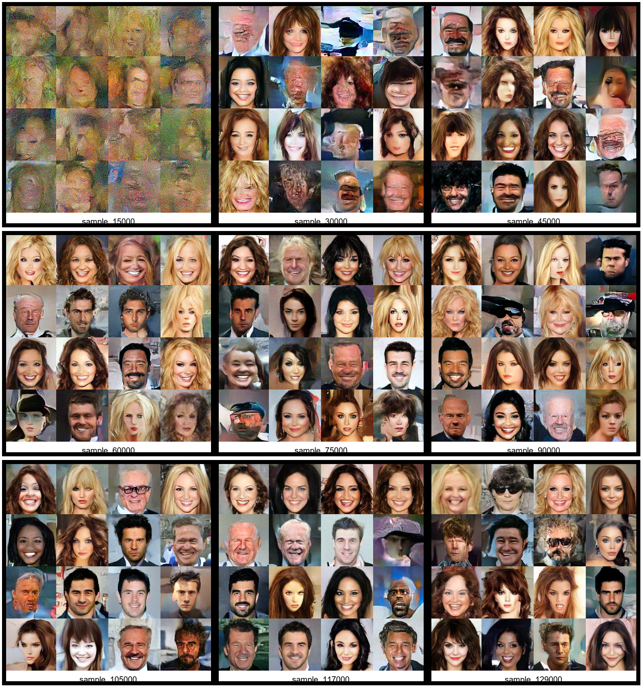
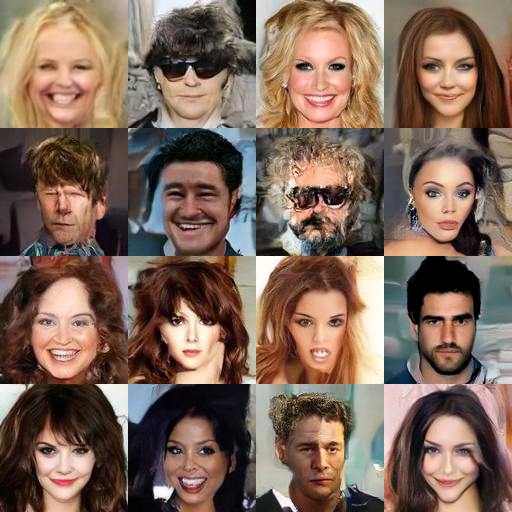

# Attribute-Conditioned Diffusion Model

PyTorch implementation of a conditional diffusion model trained with classifier-free guidance.  
The model generates 128×128 images conditioned on a fixed-length attribute vector.

Training is currently ongoing; intermediate results are provided for transparency.

---

## Sample Results

### Training Progression

The following composite image shows sampling progression during training.
Each cell is a 4×4 grid (16 samples) generated using DDIM sampling with classifier-free guidance.



Sampling checkpoints shown (left → right, top → bottom):
15k → 30k → 45k → 60k → 75k → 90k → 105k → 117k → 129k steps

---

### Near-Final Samples

Random samples generated near the current training stage:



---

## Model Overview

- Architecture: UNet with residual blocks and self-attention
- Resolution: 128×128
- Input channels: 3 (RGB)
- Conditioning: fixed-length attribute vector
- Prediction type: **v-prediction**
- Attention applied at deeper UNet resolutions

### UNet Details

- Base channels: 192
- Channel multipliers: [192, 384, 768, 768]
- Time embedding dimension: 512
- Conditioning injected via additive embedding
- Group Normalization + SiLU activations

---

## Diffusion Setup

- Timesteps: 1000
- Noise schedule: cosine schedule
- Objective: mean squared error on v-prediction
- Sampler: DDIM
- Sampling steps: 50
- Classifier-Free Guidance scale: 4.0
- Conditional dropout probability: 0.15

---

## Training Details

- Batch size: 4
- Optimizer: AdamW
- Learning rate: 1e-4
- Weight decay: 0.01
- Gradient clipping: 1.0
- Mixed precision training (AMP)
- EMA decay: 0.9999

The training script includes:
- automatic checkpointing
- full RNG state restoration
- resumable training from `latest.pt`
- periodic DDIM sampling during training

---

## Checkpointing

Two types of checkpoints are saved:

1. **Training checkpoints**
   - Optimizer state
   - Gradient scaler
   - RNG states
   - Model weights
   - EMA weights

2. **Clean inference checkpoints**
   - Model weights only
   - EMA weights only

Clean checkpoints are intended for inference and sampling.

---

## Sampling

Sampling is performed using DDIM with classifier-free guidance.

```bash
cd inference
python sample.py
```
Sampling configuration (CFG scale, number of steps, checkpoint paths) is defined directly in `sample.py`.

---

## Training
To start or resume training:
```bash
python train.py
```
All hyperparameters and paths are defined directly in the training script.

---

## Notes
 - Training is ongoing and expected to continue to 200k steps.
 - Current samples are provided to document model progression.
 - The code prioritizes clarity and reproducibility over abstraction.

---

## License

MIT